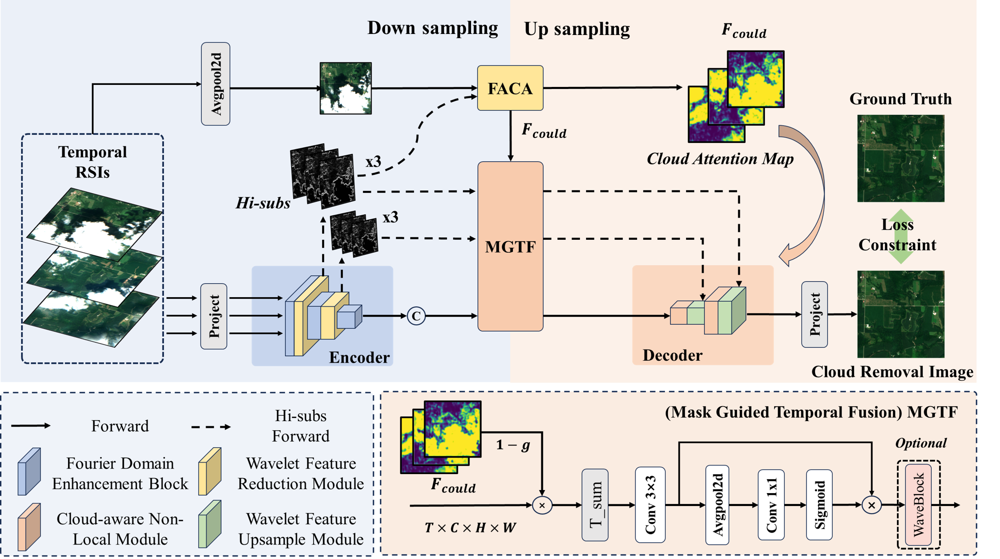
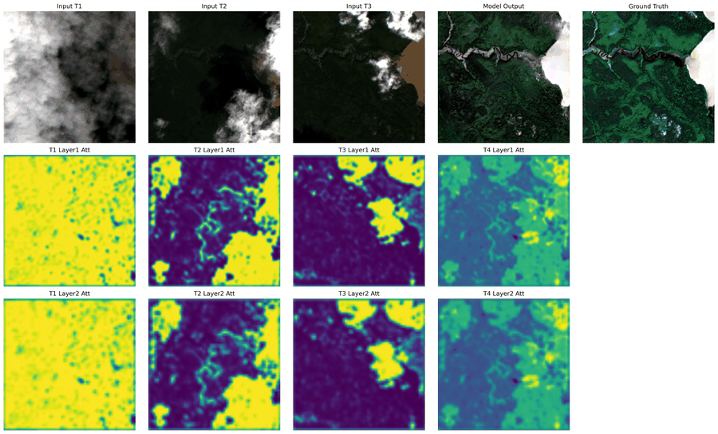

# WaveCloudNet

Official implementation of **WaveCloudNet**, a multi-temporal remote sensing cloud removal model.

> Paper status: **under review**.  
> The paper title, author list, venue, and citation information will be updated after the review process.

## Paper

- **Title:** `WaveCloudNet: Learning Implicit Cloud Distributions for Multitemporal Cloud Removal.`
- **Authors:** `Zhang Yu`
- **Affiliation:** `AirCAS`
- **Status:** Under review
- **Code:** Training and inference code for reproducing the main model

If you use this repository, please cite the paper after the final bibliographic information is available.

## Overview

WaveCloudNet is designed for cloud removal from multi-temporal remote sensing images. The model takes several cloudy observations from different dates and reconstructs a cloud-free target image by combining wavelet-domain features, frequency-aware cloud attention, and multi-temporal feature fusion.

This open-source version keeps the core code needed for training and inference. Ablation experiments, temporary visualization scripts, generated results, checkpoints, and large datasets are excluded from the repository.

## Model Architecture



## Results Preview

The following examples are generated from local inference outputs and are provided only as qualitative previews.




## Quantitative Results

### Sen_MTC_Old

- **Checkpoint link:** `will be updated soon`

| Method |    PSNR ↑ |   SSIM ↑ |  LPIPS ↓ | FID ↓ |
| --- |----------:|---------:|---------:|----------:|
| WaveCloudNet | `28.6023` | `0.8613` | `0.2998` | `88.0075` |

### Sen_MTC_New

- **Checkpoint link:** `will be updated soon`

| Method |    PSNR ↑ |   SSIM ↑ |  LPIPS ↓ |     FID ↓ |
| --- |----------:|---------:|---------:|----------:|
| WaveCloudNet | `19.7079` | `0.6776` | `0.2897` | `79.8761` |

## Repository Structure

```text
.
├── assets/                 # Lightweight images used by README
├── evaluation/             # Offline evaluation scripts
├── inference/              # Inference scripts
├── models/
│   ├── WaveCloudNet.py      # Main model definition
│   ├── BSRN_arch.py         # Basic convolution blocks
│   └── torch_wavelets.py    # Wavelet transform modules
├── dataset.py               # Dataset definitions
├── base_dataset.py          # Base dataset utilities
├── setup_utils.py           # Dataloader and model construction
├── loss.py                  # Training losses
├── metrics.py               # Image quality metrics
├── training_utils.py        # Logging, validation, and checkpoint helpers
├── train.py                 # Training entry point
└── requirements.txt
```

## Environment

The code has been used with Python 3.9-3.11 and PyTorch. A CUDA-enabled GPU is recommended for training.

Install dependencies:

```bash
pip install -r requirements.txt
```

The dependency file also includes image readers and evaluation packages used by the inference scripts, such as `tifffile`, `opencv-python`, `rasterio`, `scipy`, `lpips`, and `clean-fid`.

## Data Preparation

This repository supports several dataset styles through `dataset.py`.

### `new_multi`

Expected files:

```text
DATA_ROOT/
├── train.txt
├── val.txt
├── test.txt
└── Sen2_MTC/
    └── <tile>/
        ├── cloud/
        └── cloudless/
```

### `old_multi`

Expected files:

```text
DATA_ROOT/
└── multipleImage/
    ├── cloudy/
    │   ├── xxx_0.jpg
    │   ├── xxx_1.jpg
    │   └── xxx_2.jpg
    └── clear/
        └── xxx.jpg
```

### `s2asiawest`

Expected files:

```text
DATA_ROOT/
├── train/
├── val/
└── test/
    └── .../patch_xxxxxx/
        ├── GT__xxx.tif
        ├── IN1__xxx.tif
        ├── IN2__xxx.tif
        └── IN3__xxx.tif
```

## Training

Edit the `config` dictionary in `train.py`, especially:

- `data_root`
- `dataset_type`
- `batch_size`
- `num_epochs`
- `save_dir`
- `pretrained_path`
- `log_file`

Then run:

```bash
python train.py
```

The training pipeline builds the model through `setup_utils.py`, which currently imports:

```python
from models.WaveCloudNet import WaveDH
```

Training outputs such as checkpoints, TensorBoard logs, and intermediate visualizations are intentionally ignored by Git.

## Inference

Use the script matching your dataset:

```bash
python inference/test_png.py
python inference/test_png_old.py
python inference/test_s2awest.py
```

Each inference script loads `models.WaveCloudNet.WaveDH`, restores a checkpoint, runs batch inference, and saves prediction results.

## Checkpoints

Model weights are not included in the Git repository because they are large binary files. Recommended release options:

- GitHub Releases
- Zenodo
- Google Drive / OneDrive / Baidu Netdisk

Place downloaded checkpoints under:

```text
checkpoints/
```

Then update the checkpoint path in the corresponding training or inference script.

## Evaluation

Offline evaluation scripts are placed under `evaluation/`.

```bash
python evaluation/eval.py
python evaluation/eval_by_different_cloud_new.py
python evaluation/eval_by_different_cloud_old.py
python evaluation/eval_multi_folders.py
python evaluation/eval_s2awest.py
```

The project includes PSNR, SSIM, SAM, LPIPS, and FID evaluation utilities. FID may require an Inception model file such as `inception-2015-12-05.pt`; this file is not part of the repository and should be downloaded or generated according to the evaluation library requirements.

## Citation

The paper is currently under review. Citation information will be added after acceptance.

```bibtex
@article{wavecloudnet2026,
  title   = {<paper title>},
  author  = {<author list>},
  journal = {Under review},
  year    = {2026}
}
```

## License

Please add a license before public release, for example `MIT`, `Apache-2.0`, or a research-only license depending on your publication and dataset constraints.
